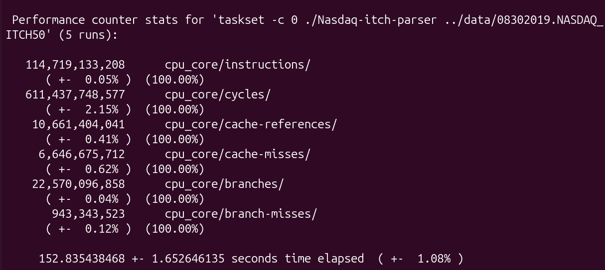

# Devlog #2.1: Zero-Copy File I/O with Memory Mapping (Phase 2)

## Introduction
After I finished the basic implementation of the parser in Phase 1, in the first part of phase two I try to optimize it. Using `std::ifstream::read()` meant that every single read forced a context switch. The operating system had to copy data from the disk into a kernel space buffer, and then copy it again into my user space buffer.

In this first part of Phase 2, my goal was to eliminate this I/O overhead by using memory mapping.

## What I Implemented

### 1. Memory Mapping (`mmap`)
Instead of calling read for each struct in the 10GB binary file, I mapped the file directly into my program's virtual address space using `mmap` (and `MapViewOfFile` for Windows).
I created a standalone file that uses `#ifdef` and separates 4-step Windows api function calls from the 3-step Linux function calls,
which assures the parser will work on both platforms.

This means the OS just gives me a single pointer to the start of the file and as I iterate forward, the CPU's hardware automatically pages the data from the SSD into RAM - this also means I can treat my data as continuous memory(I explain how I use this in the next point). This bypasses the double-copying entirely and removes system calls from the main parsing loop.

### 2. In-Place Parsing and Pointer Arithmetic
Since the whole file is now treated as one continuous array in memory, I didn't need any intermediate buffers anymore.

To move through the file, I can just use simple arithmetic: I just add the message size to my current pointer (`ptr += message_length`) to jump to the next packet.
To actually parse the data, I used `reinterpret_cast<const OrderMessage*>(ptr)`. This lets me place my C++ structs directly over the raw memory, meaning I can read the fields directly from RAM without having to copy any bytes.

## Benchmarks & Hardware Profiling
Bypassing the OS kernel in the main parsing loop the brought massive speedups. More interestingly, the performance gap between Windows and Linux almost completely disappeared:

Results from std::chrono printouts:

* **Windows:** ~1236s ➔ ~140s
* **Linux:** ~410s ➔ ~126s
  
In Phase 1, I would assume the gap was huge because Linux handles standard file I/O system calls much more efficiently than Windows. But with memory mapping, we bypass the kernel entirely on both platforms, which eliminates most of the difference.

Here are the hardware profiling stats from Linux `perf` :

Looking at the results, the execution is around 153 seconds, which is again big improvement from the previous 435 seconds. 
However, the hardware counters reveal my new bottlenecks:
* **Instructions Per Cycle (IPC): ~0.19** — The CPU executed about 114.7 billion instructions over 611.4 billion cycles. This means it is spending a massive amount of time idling and waiting on memory to be fetched.
* **Cache Miss Rate: ~62.3%** — Out of ~10.6 billion cache references, about 6.6 billion resulted in a cache miss.

To reason about this, it is important to see that both of these stats are quite worse than in Phase 1 but the execution time
has improved. This is probably because the memory copying loops our OS used in Phase 1 are quite predictable and as we can see, they also inflate
the number of instructions - the total instruction count dropped rapidly from Phase 1 to Phase 2. And so now that those predictable instructions
are not used anymore the data structure bottlenecks are more prominent in the perf printout.

## Reflections & Next Steps
By adding memory mapping, I solved the disk I/O bottleneck. The parser now runs as fast as the SSD allows. But the `perf` stats make it obvious that the new problem is memory access and the CPU cache.

The low IPC and high cache misses happen because I'm still using `std::unordered_map` and `std::map` from Phase 1. These standard containers allocate nodes dynamically all over the heap, which forces the CPU to constantly wait on slow RAM fetches instead of using the fast L1/L2 cache.

In Devlog #2.2, I will fix this by replacing these standard data structures with better fit data structures.