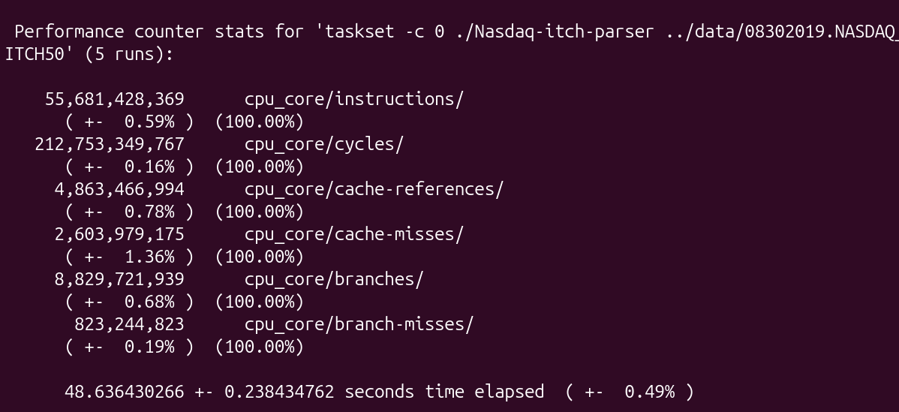

# Devlog #2.2: Custom Data Structures and Hardware Optimization (Phase 2)

## Introduction
After resolving the disk I/O bottleneck with memory mapping in Devlog 2.1, the CPU cache and memory access patterns became the primary issues. 
The standard library containers (`std::map` and `std::unordered_map`) allocate memory dynamically on the heap, which I believed to cause poor memory locality and high cache miss rates. As I later found out the problem is also their unnecessary complexity for this project,
which adds many CPU worsens the total execution time.

In this second part of Phase 2, the goal was to replace these standard containers with custom, cache-friendly data structures to optimize CPU execution, without using some nonstandard libraries to offload this task,
since the main goal of this project is learning.

## What I Implemented

### 1. Custom Order Book
Instead of using a node-based `std::map`, I built a custom `PriceLevelBook` backed by a continuous `std::vector`. 
While I could have used standard library alternatives like `std::priority_queue`, since what I implemented is basic implementation of sorted priority queue, 
building a custom structure allowed for deeper hardware optimization and lowered total amount of CPU instructions.
To determine the exact memory requirements, I profiled the dataset. The test revealed a maximum depth of 7992 price levels for a single book, but the 90th percentile was only around 245 levels. Using this data, I set the vector to reserve 256 slots by default. 
This guarantees contiguous memory and zero reallocation overhead for the vast majority of the market,
while keeping the total RAM footprint minimal. Insertions and deletions are handled using binary search (`std::lower_bound`), maintaining a perfectly sorted array.

### 2. Flat Hash Map with Robin Hood Hashing
The std::unordered_map used for storing active orders relied on heap allocations, scattering data and causing severe cache misses. To fix this, I built a custom open-addressing FlatHashMap and realigned the ActiveOrder struct to minimize its memory footprint.
I initially planned to use basic linear probing. However, with a peak of 136 million active orders and a required 50% load factor to maintain speed, I needed to pre-allocate over 270 million slots. This massive allocation exceeded my available RAM, 
forcing the operating system to swap memory pages to the SSD, which completely bottlenecked the CPU.
To solve this hardware limit, I researched and implemented Robin Hood hashing. This algorithm tracks how far an item is pushed from its ideal bucket (Distance to Initial Bucket, or DIB). During insertion, it swaps a new order with an occupying one if the new order has traveled further.
While this naturally fixes the data clustering issues of linear probing, my primary motivation was memory efficiency. Because Robin Hood hashing packs data tightly while keeping search times flat, it allows for a ~90% load factor without performance loss. As a result, I only needed to allocate space for ~170 million orders (including a safety buffer).
This fit perfectly into RAM, eliminating the SSD swap entirely, compared to the 270 million slots that a standard linear probing implementation might require.
## Benchmarks & Hardware Profiling
Replacing the standard library data structures resulted in significant performance gains across both operating systems.

Execution times:
* **Windows:** ~140s ➔ 59s
* **Linux:** ~126s ➔ ~48.6s

Here are the hardware profiling stats from Linux `perf` using the custom data structures:

The `perf` output shows the execution completed in 48.6 seconds. The hardware counters highlight the underlying reasons for the speedup:
* **Instructions:** ~55.6 billion (down from ~114.7 billion)
* **Cycles:** ~212.7 billion (down from ~611.4 billion)
* **Cache References:** ~4.86 billion
* **Cache Misses:** ~2.60 billion
* **Instructions Per Cycle (IPC):** ~0.26 (up from ~0.19)
* **Cache Miss Rate:** ~53.5% (down from ~62.3%)

The data shows minor improvements in the IPC and cache miss rate. The primary factor driving the reduced execution time is the instruction count. The standard library data structures generated significant instruction bloat due to dynamic memory allocations and pointer chasing. By switching to contiguous memory and fixed allocations, the total instructions were cut by more than half.

## Reflections & Next Steps
The custom data structures successfully resolved lot of the memory access bottlenecks. By aligning memory and avoiding dynamic allocations, the parser now processes the data more efficiently.

In the next phase, I will be simulating a network stack. This will deviate slightly from the current structure of the project, but it is necessary to accurately reflect how these systems receive and process data in the real world.